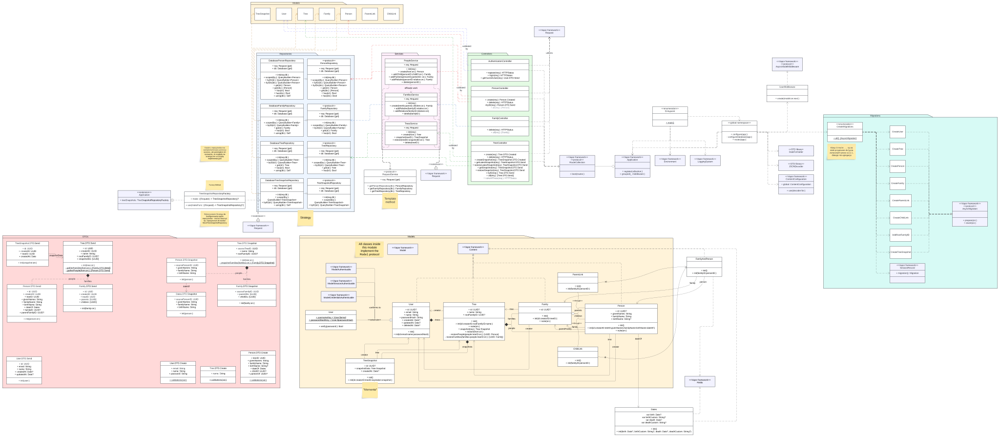

# Technical Specification

## UML Diagram

### Domain Driven Design

The server is designed with the principles of [Domain Driven Design](https://en.wikipedia.org/wiki/Domain-driven_design). There are clearly defined parts of the application (as seen in the [diagram](#uml-diagram) above). The sections are as follows:

- **Controllers**
- **Services**
- **Repositories**
- **Models**
  - **DTOs** (Data Transfer Objects)

Let's dive into each section to describe them more closely.

#### Controllers

Controllers define the endpoints the users are able to hit. They are designed to be very concise and to offload work to services as soon as possible. There two main responsibilities of controllers in the Genalogee app:

- **Data validation** - validating the data before sending it further to other services.
- **Response formation** - converting available data into expected API response formats (see [DTOs](#dtos)).

#### Services

Services are the heart of the application - that's where *most* of the business logic lies. There are multiple services - `PeopleService`, `FamiliesService` and `TreesService`. Each of them is responsible for **maintaining their section** of the program.

For example: `PeopleService` is responsible for adding new people to the tree, as well as adding their relatives or removal of certain persons.

Services might communicate between one another - let's again take `PeopleService` as an example here - to add a relative, this service calls `FamiliesService` and requests it to add a person of certain ID to the family.

#### Repositories

To properly abstract the database from the application (***separation of concerns***), repositories are put into place. They are implemented in such way, that allows for simple change of the data backend. The most common operations are abstracted away from the developer, so they can simply call the repository to receive objects of certain IDs from the database or check if an ID is persisted there and so on.

Unarguably, the most important feature of the repositories is providing an easy way to do secure operations on data. By default, the queries are always filtered by the current user - this makes it very hard for the developer to unintentionally write leaky queries.

If there is need for a very specialized query in the *Genealogee App*, the repositories allow the developer to construct their own queries with the `scoped` and `byID` methods. Query builders are returned by those, which leaves the developer with great power, but also great responsibility.

#### Models

Models are the central part of the *Genealogee App*. All of the relations between logic entities are defined in data models. As seen in the [diagram](#uml-diagram) above, the relations are pretty complex. Since they are described visually, we won't go into much detail in the written description. Take a note that aside from the SVG version of the diagram, a PDF document with the same diagram is also available [here](assets/UML.pdf).

##### Database

The database connection is handled by the [*Vapor framework*](https://vapor.codes). We use PostgreSQL as the production database, and SQLite for development and testing.

Too see the migrations check the [`Sources/App/Migrations`](../Sources/App/Migrations/) folder.

##### DTOs

DTOs (aka *Data Transfer Objects*) are the connectors between [Models](#models) and the Users, accessed through [Controllers](#controllers). Multiple different DTOs are used in the app.

Specific folders for specific use cases:

- User input - [`Sources/App/DTOs/Create`](../Sources/App/DTOs/Create)
- Server results - [`Sources/App/DTOs/Send`](../Sources/App/DTOs/Send)
- Dedicated snapshot DTOs - [`Sources/App/DTOs/Snapshot`](../Sources/App/DTOs/Snapshot)

## Design patterns

Most notable design patterns implemented in the application are:

- **Strategy pattern** in the repositories architecture. This allows for an easy, nearly drop-in replacement for the database framework.
- **Factory method** in the enablement of the repositories architecture. We can pass different factories for the repository backend during the [configuration](../Sources/App/configure.swift).
- **Template method** is used in the services. All services implement the `RequestService` protocol which has default implementation for it's functions. Some services can overwrite these methods to have them specialized for themselves.
- **Memento** pattern is used for storing snapshots of the trees. Tree produces a snapshot of it's contents, then a TreeSnapshot is created to store the state in the database. Then on the user's request, trees can be restored with the previously saved data.
- *Planned*
  - **Step Builder Pattern** for the restoration of snapshots. This pattern will require two additional classes: `TreeRevitalizer.PeopleStep` and `TreeRevitalizer.FamiliesStep`, while the handler would be inside of the Tree itself. This pattern modifies the **builder pattern** and makes it have steps using another pattern called **chain of responsibility**.
